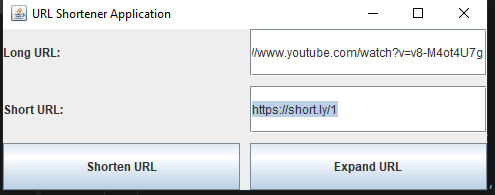
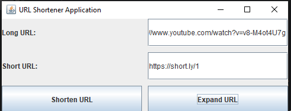

# 📌 URL Shortener Application (Java Desktop App)

A simple **URL Shortener Application** built using **Java Swing** that converts long URLs into short, unique links using **Base62 Encoding**.

This project demonstrates concepts of:

* Encoding Algorithms
* HashMap Data Structures
* File Handling
* Persistent Storage
* GUI Development

---

## 🚀 Features

* 🔗 Convert Long URL → Short URL
* 🔁 Expand Short URL → Original URL
* 💾 Persistent storage using file system (`urlmappings.txt`)
* 🔢 Base62 Encoding for unique short codes
* 🖥️ Simple and clean Swing GUI
* 🔄 Prevents duplicate short links for same URL

---

## 🛠️ Technologies Used

* **Java**
* **Java Swing (GUI)**
* **HashMap**
* **Base62 Encoding**
* **File Handling (FileWriter, BufferedReader)**
* **OOP Concepts**

---

## 📷 Screenshots

|                Shorten                   |                  Expand                   |
| ---------------------------------------- | ----------------------------------------- |
|  |  |

---

## 🧠 How It Works

### 1️⃣ Shortening Process

* A counter value is maintained.
* Counter is encoded using **Base62 algorithm**.
* Generated short code is mapped to long URL.
* Mapping is stored:

  * In memory (HashMaps)
  * In file (`urlmappings.txt`) for persistence
* Final short URL format:

  ```
  http://short.ly/abc12
  ```

---

### 2️⃣ Expanding Process

* Extract short code from URL
* Look up mapping in HashMap
* Return original long URL

---

## 📂 Project Structure

```id="p1x7zq"
URL-Shortener-DSA-Java-Project/
 ├── A.java        // Base62 Encoder/Decoder
 ├── Url.java      // Core URL shortening logic
 └── Gui.java      // Swing GUI Interface
```

---

## 📌 Core Components

### 🔹 `A.java`

* Encodes numbers to Base62
* Decodes Base62 back to number

### 🔹 `Url.java`

* Handles URL mapping
* Stores data in HashMaps
* Reads/Writes mappings to file
* Maintains counter safely

### 🔹 `Gui.java`

* Provides user interface
* Handles button events
* Connects UI with URL logic

---

## ▶️ How to Run

1. Open project in IntelliJ / Eclipse / NetBeans
2. Compile all files
3. Run `Gui.java`
4. Enter:

   * Long URL → Click **Shorten**
   * Short URL → Click **Expand**

---

## 📚 Concepts Implemented

* Base62 Encoding Algorithm
* HashMap-based Bidirectional Mapping
* Persistent Storage via File Handling
* Event-driven Programming
* Object-Oriented Design
* Desktop GUI Application Development

---

## 🎯 Learning Outcome

This project demonstrates:

* Real-world system design (like Bitly)
* Encoding & Decoding logic
* Data persistence techniques
* Efficient lookup using HashMap
* Java GUI integration with backend logic

---

## 🔮 Future Improvements

* Add database (MySQL) instead of text file
* Add URL validation
* Add copy-to-clipboard feature
* Add link expiry feature
* Convert into Web Application (Spring Boot)
* Add analytics (click count tracking)

---

## 👨‍💻 Author

**Kashif Raza**
